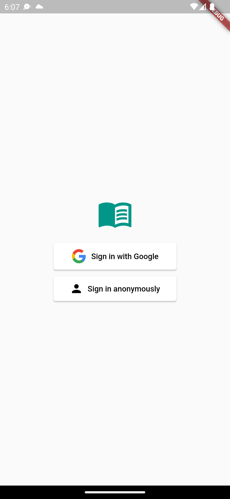
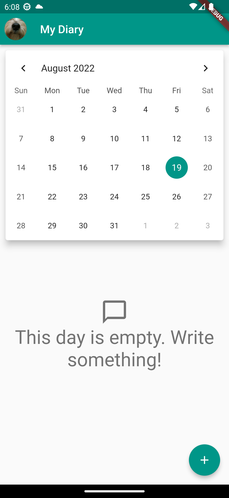
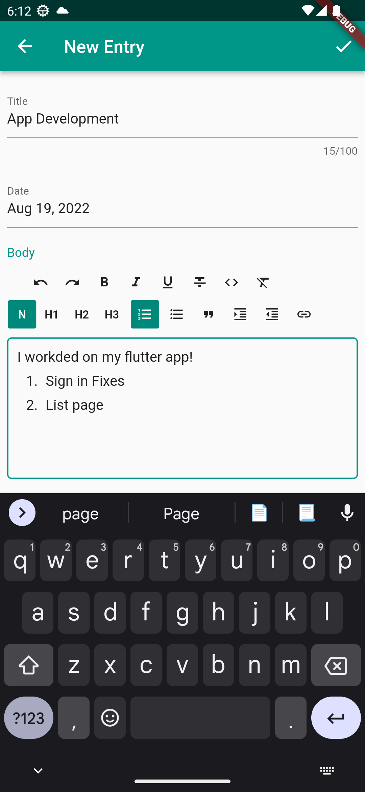
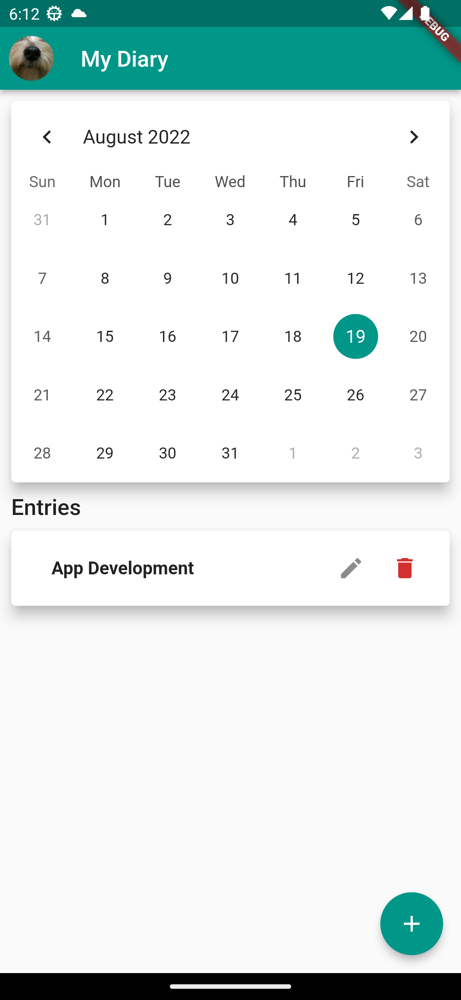
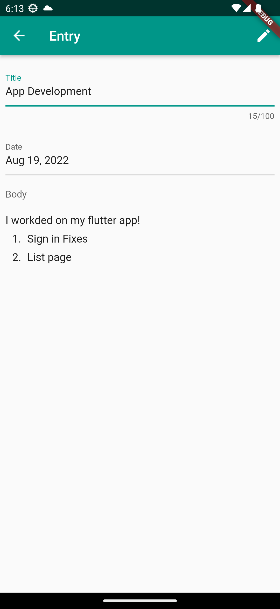

# My Diary App

`My Diary` is a Flutter App Example. It is a personal diary to write your memories. It stores the data in the device using `Hive`.

## Screenshots

    
    
    

    
    

## Main libs used

- [Table Calendar](https://pub.dev/packages/table_calendar)
- [Flutter Quill](https://pub.dev/packages/flutter_quill)
- [Google Sign In](https://pub.dev/packages/google_sign_in)
- [Hive](https://pub.dev/packages/hive)
- [Uuid](https://pub.dev/packages/uuid)
- [Provider](https://pub.dev/packages/provider)
- [Mockito](https://pub.dev/packages/mockito)
